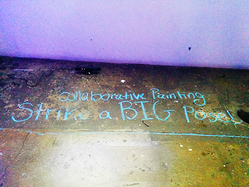
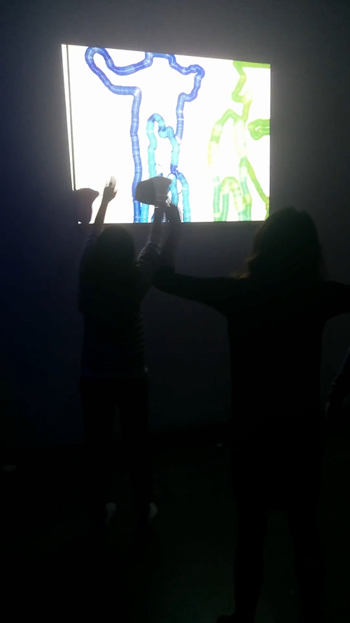

#Collaborative Painting 
##Make strokes with your body movement!

This uses ofxKinect and ofxOpenCv for the contour tracking. What I do is check if the bounding width on the "blobs" have changed severely between frames. If so that means the user has stuck a pose, and the contour of that pose gets pushed into another array. I then draw the contour by making it an ofPolyline and use ofxInkSim to make the watercolor strokes. 

This is using openFrameworks v0.8.0. The openCV files are edited and I included them in my upload. They should replace your own openCV files in your addons for this to work. 

<iframe src="https://player.vimeo.com/video/149797977" width="500" height="375" frameborder="0" webkitallowfullscreen mozallowfullscreen allowfullscreen></iframe>

<a href="https://vimeo.com/149797977">Watch the video: collaborative painting</a> from <a href="https://vimeo.com/user18281455">Dana Avesar</a> on <a href="https://vimeo.com">Vimeo</a>.

